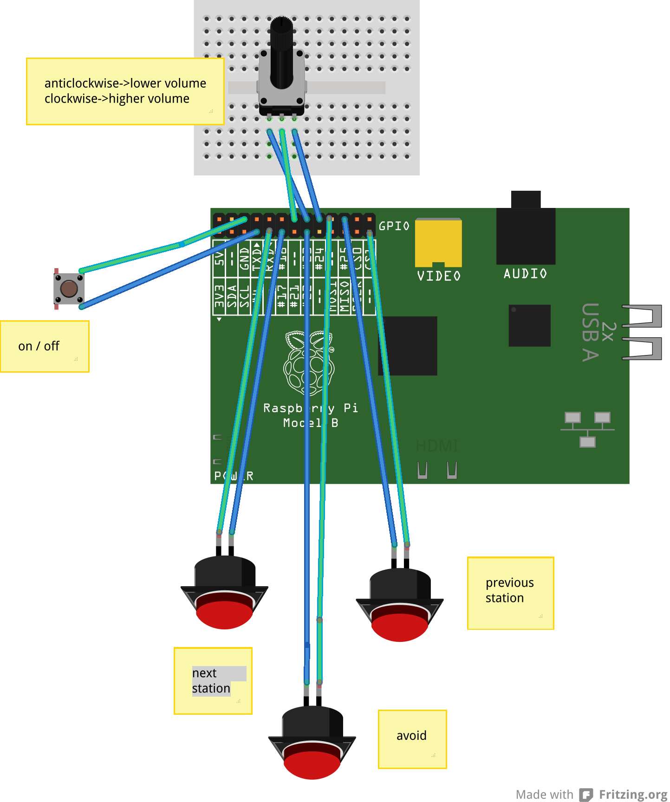

Radiodan Example app - physical interface
===

This is a tiny Ruby app that provides a physical interface to complement the [Radiodan Example application](https://github.com/radiodan/radiodan_example).

Wiring
---

This interface involves:
 - 3x momentary push buttons
 - 1x rotary encoder

Wire up as follows:

Changing pin numbers
---

The app
---

The app uses the [Frankenpins](https://github.com/radiodan/frankenpins) rubygem to connect the buttons and convert them to messages published using [Faye](http://faye.jcoglan.com/). These messages are received by the main Radiodan Example app and are used to control the radio.
